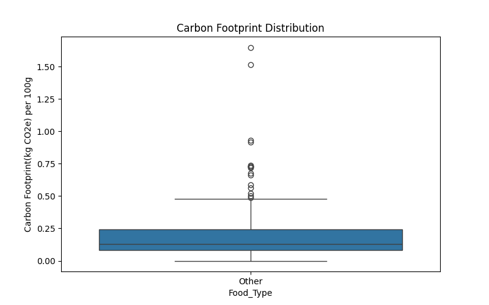
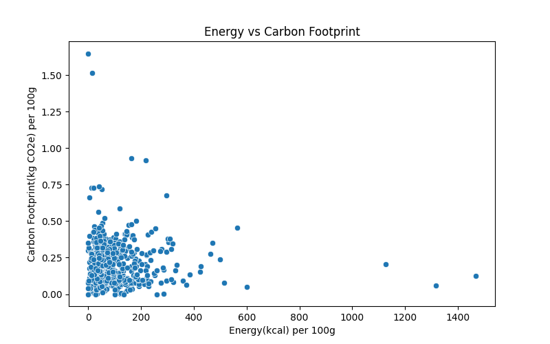
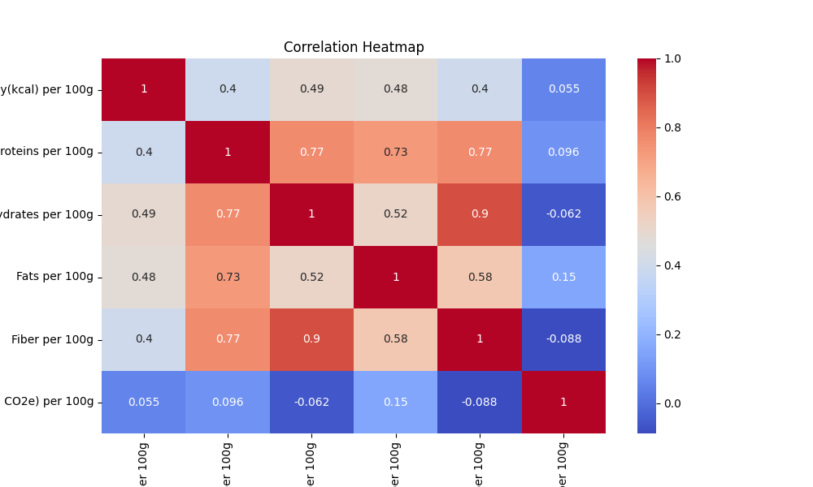
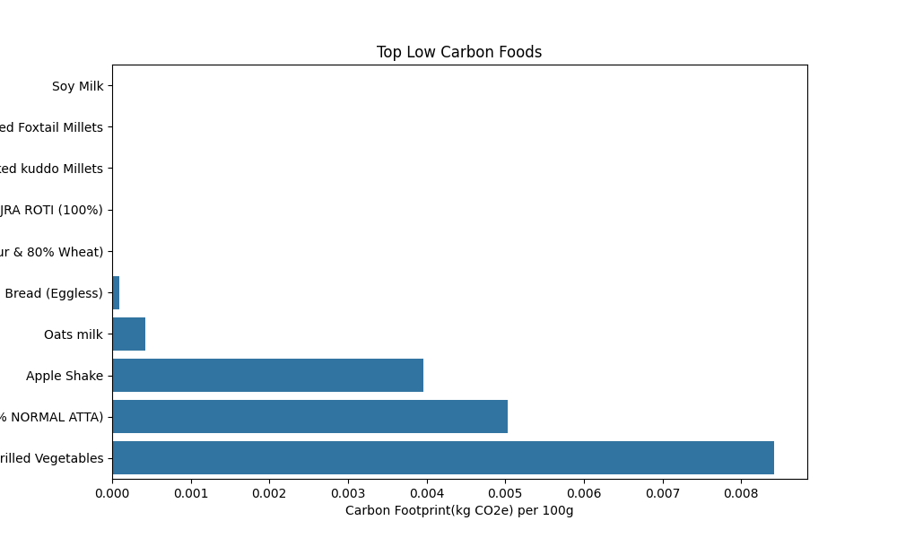

# 🌱 Sustainable Diet Optimization Using Data Science

## 📌 Overview

This project presents an **AI-driven diet optimization system** that generates personalized meal plans by balancing **nutritional requirements** and minimizing **carbon footprint**.
It combines **data preprocessing, feature engineering, and linear programming (optimization)** to recommend sustainable and healthy diets.

---

## 🚀 Key Features

* 🍽️ Personalized diet recommendations based on user preferences
* 🌱 Carbon footprint minimization for sustainable food choices
* 🧠 Constraint-based optimization using Linear Programming (PuLP)
* ⚙️ Data preprocessing and feature engineering
* 📊 Insightful visualizations for better understanding
* 🛑 Allergy-aware filtering system

---

## 🛠️ Tech Stack

* Python
* Pandas, NumPy
* PuLP (Linear Programming)
* Matplotlib, Seaborn

---

## 📂 Project Structure

```
sustainable-diet-optimization/
│
├── data/
│   ├── nutrition_cf.csv
│   └── nutrition_cf_preprocessed.csv
│
├── src/
│   ├── preprocess.py
│   ├── optimize.py
│   ├── visualize.py
│   ├── main.py
│   └── __init__.py
│
├── assets/
│   ├── carbon_distribution.png
│   ├── correlation_heatmap.png
│   ├── energy_vs_carbon.png
│   ├── low_carbon_foods.png
│
├── outputs/
│   ├── (generated visualizations)
│
├── README.md
├── requirements.txt
└── .gitignore
```

---

## ⚙️ How It Works

### 1️⃣ Data Preprocessing

* Cleans dataset and handles missing values
* Converts nutritional values to per 100g
* Encodes categorical features and allergies

### 2️⃣ Personalization

* Accepts user preferences (calories, protein, diet type, allergies)
* Filters dataset based on constraints

### 3️⃣ Optimization

* Uses **Linear Programming (PuLP)**
* Minimizes carbon footprint
* Ensures nutritional requirements are satisfied

### 4️⃣ Visualization

* Carbon footprint distribution
* Energy vs carbon trade-off
* Correlation between nutrients and emissions
* Identification of low-carbon food options

---

## 📊 Visualizations

### 🌱 Carbon Footprint Distribution



### ⚡ Energy vs Carbon Trade-off



### 🔗 Correlation Heatmap



### 🥗 Low Carbon Food Options



---

## ▶️ How to Run

### 1. Install dependencies

```
pip install -r requirements.txt
```

### 2. Run the project

```
python -m src.main
```

---

## 📊 Sample Output

* Optimized meal plan based on user constraints
* Total carbon footprint and energy values
* Visualizations saved in `outputs/` folder

---

## ⚠️ Note

* User inputs are currently **hardcoded for demonstration purposes**
* Can be extended to:

  * CLI input
  * Web app (Streamlit)

---

## 🔮 Future Improvements

* Quantity-based optimization (portion control)
* Real-time user input interface
* Region-based filtering
* Web/mobile deployment

---

## 💡 Conclusion

This project demonstrates how **data science and optimization techniques** can be applied to solve real-world problems like **sustainable and personalized diet planning**.

---

⭐ If you found this project useful, consider giving it a star!
